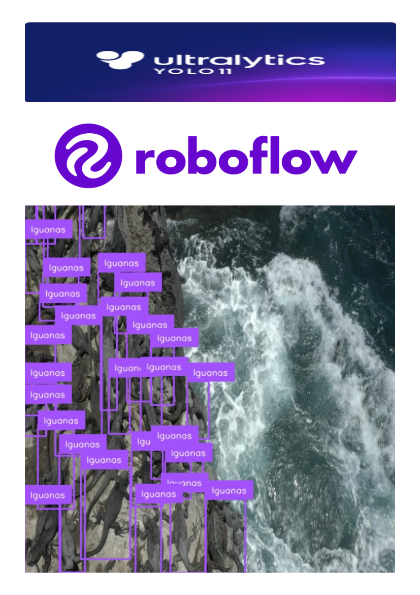

<h1 align="center">
    
</h1>

<h3 align="center">A computer science student passionate about deep learning 🧠🤖 </h3>

 

 
🌱 I’m currently learning **computer vision with yolo, sam and sahi**

💬 Ask me about **Java, Python, React, Software Design... or anything [here](https://github.com/randyRivera0)**

 

 

 
  
  

 

 ---

## 💼 **Projects**  
Here are some of the projects I have developed:
### 1. 🪞 **Land Use And Wildlife DL Semantic Segmentation - Roboflow**  
- **Description:**  Utilized drone imagery to develop a semantic segmentation model aimed at tracking animal locations across different land uses in the Galapagos Islands. By leveraging Roboflow for data preprocessing and model training, the project enhances the accuracy of land classification and wildlife detection. This information enables biologists to study animal behavior and implement targeted conservation strategies, ultimately contributing to the protection of this unique ecosystem.

- **Used technologies:** YOLO, SAHI, SAM, Roboflow.  
- [🔗 Repositorio](https://github.com/randyRivera0/LandUseAndWildlifeDLSemanticSegmentation.git)

    

### 2. 💡 **Broker Backend**  
- **Description:** Developed a task management system that integrates RabbitMQ for real-time communication, SQLite3 for lightweight data storage, and Docker for containerization, all of which are open source and free to use. Users can create, assign, and track tasks while receiving seamless notifications and updates through message queues. RabbitMQ ensures reliable and asynchronous communication between the frontend and backend services, enhancing responsiveness. SQLite3 provides a simple yet effective database solution for managing task data, while Docker allows for easy deployment and scaling across various environments. 
- **Used technologies:** RabbitMQ, SQLite, Docker.  
- [🔗 Repositorio](https://github.com/randyRivera0/Task-Management-Web-Backend-RabbitMQ-SQLite/tree/back)

    

### 3. 🌐 **EDA Billionaires - DF, Pandas, Seaborn**  
- **Description:** Exploratory data analysis (EDA) of billionaire wealth trends utilizing Python's Pandas and Seaborn libraries. This project involved cleaning and preprocessing large datasets to uncover insights into wealth distribution, demographic patterns, and economic influences. By employing visualizations such as scatter plots, bar graphs, and heatmaps, I effectively illustrated key findings, facilitating data-driven decision-making. 
- **Used technologies:** Pandas, Seaborn.  
- [🔗 Repositorio](https://github.com/randyRivera0/EDA-Billionaires-Pandas-Seaborn)

    

---
 
<h2 align="center">⚒️ Languages-Frameworks-Tools ⚒️</h2>
 

       

 

  <h2>🐍 My Contributions 🐍</h2>
   
  
  
     

<h2 align="center">⚡ Stats ⚡</h2>
 

  
  
   
  

  

 
